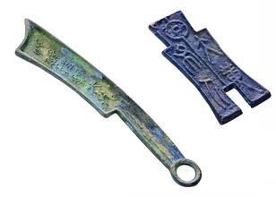
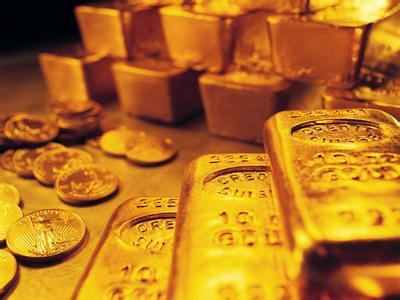

# 货币概述
随着人类文明的发展，社会活动出现分工，逐渐有了物品交换的需求，于是出现来商品，其中分离出来固定地充当一般等价物的特殊商品，就是货币；货币是商品交换发展到一定阶段的产物。货币的出现大大降低了人们物品交换的难度，加快了资源配置的速度，成为商品生产分配过程中不可缺少的特殊道具，在人类文明的发展中起了非常重要的作用。

## 货币作用
由于货币属于商品，因此他同所有商品一样也具有使用价值和交换价值。当处在不同形式的价值运动中时，货币所表现出来的作用也不尽相同：价值尺度、流通手段、支付手段、贮藏手段和世界货币。其中，价值尺度和流通手段是货币的基本职能。另外三种职能则是在两者的基础上形成的派生职能。

**价值尺度**
价值尺度是货币作为社会劳动的直接体现。货币本身作为一种商品，可以以自己为标准，与其他商品进行量的比较，而此时商品的价值形式就转化为价格形式，商品通过货币进行表达的价值形式即为价格。当货币执行价值尺度这一职能时，货币只需要以想像中的或是观念上的形式存在就可以了，然而他的单位则必须依赖于现实中流通的货币。正是由于货币的价值尺度功能，使得人们可以将不同形式的商品先转化为货币的价格形式，然后再与其他商品进行交换。货币本身作为商品也存在不同货币之间量的差别，因此人们为货币也制定了一个量的标准，即规定价格标准（有时亦称价格标度）。

**流通手段**
流通手段的职能是货币作为商品交换的媒介，即购买手段的职能。其主要特点是在商品买卖中，商品的让渡和货币的让渡在同一时间内完成，通俗地说是一手交钱、一手交货。因此，从价值运动的角度观察，货币执行流通手段职能时，在同一时间内，价值的运动是双向的。即卖方在得到价值的同时出让使用价值，买方在让渡价值的同时获得使用价值。
货币作为流通手段时，称为通货。

**贮藏手段**
贮藏手段的职能，指的是当货币退出流通领域，被当作社会财富的代表被保存起来时货币所发挥的作用。一般来说，价币用作价值储藏风险是最低的。但是，通胀会削减购买力，而且货币并无利息收入，因此，长期来说，价值储存的功能并不及其余的能力重要。

**支付手段**
货币执行支付手段的职能是随着商品赊账买卖的产生而出现的。在赊销赊购中，货币被用来偿还债务。后来，它又被用来支付地租、利息、税款、工资等。

**世界货币**
当货币跃出国内市场，在世界市场上购买外国商品，支付国际收支差额，作为社会财富的代表在国与国之间转移时，它就具有了世界货币的职能。

货币的本质是一般等价物，正是它使得商品交易与服务贸易等活动更加方便、高效。 [^currency_wiki]

[^currency_wiki]: 中文维基百科-货币 http://zh.wikipedia.org/wiki/货币

## 货币简史
历史上不同地区曾有过不同的商品交换充当过货币，后来货币商品逐渐过渡为金银等贵金属。随着商品生产的发展和交换的扩大，商品货币（金银）的供应越来越不能满足对货币日益增长的需求，又逐渐出现了代用货币、信用货币，以弥补流通手段的不足。进入20世纪，金银慢慢地退出货币舞台，不兑现纸币和银行支票成为各国主要的流通手段和支付手续。

**物物交换**
在原始社会，人们使用以物易物的方式，交换自己所需要的物资，比如一头羊换一把石斧。但是有时候受到用于交换的物资种类的限制，不得不寻找一种能够为交换双方都能够接受的物品。这种物品就是最原始的货币。牲畜、盐、稀有的贝壳、珍稀鸟类羽毛、宝石、沙金、石头等不容易大量获取的物品都曾经作为货币使用过。

**金属货币**
经过长年的自然淘汰，在绝大多数社会里，作为货币使用的物品逐渐被金属所取代。使用金属货币的好处是它的制造需要人工，无法从自然界大量获取，同时还易储存。数量稀少的金、银和冶炼困难的铜逐渐成为主要的货币金属。某些国家和地区使用过铁质货币。

早期的金属货币是块状的，使用时需要先用试金石测试其成色，同时还要秤量重量。随着人类文明的发展，逐渐建立了更加复杂而先进的货币制度。古代希腊、罗马和波斯的人们铸造重量、成色统一的硬币。这样，在使用货币的时候，既不需要秤量重量，也不需要测试成色，无疑方便得多。这些硬币上面带有国王或皇帝的头像、复杂的纹章和印玺图案，以免伪造。

中国最早的金属货币是商朝的铜贝。商代在我国历史上也称青铜器时代，当时相当发达的青铜冶炼业促进了生产的发展和交易活动的增加。于是，在当时最广泛流通的贝币由于来源的不稳定而使交易发生不便，人们便寻找更适宜的货币材料，自然而然集中到青铜上，青铜币应运而生。但这种用青铜制作的金属货币在制作上很粗糙，设计简单，形状不固定，没有使用单位，在市场上也未达到广泛使用的程度。由于其外形很像作为货币的贝币，因此人们大都将其称为铜贝。

据考古材料分析，铜贝产生以后，是与贝币同时流通的，铜贝发展到春秋中期，又出现了新的货币形式，即包金铜贝，它是在普通铜币的外表包一层薄金，既华贵又耐磨。铜贝不仅是我国最早的金属货币，也是世界上最早的金属货币。

**金银等贵金属**
西方国家的主币为金币和银币，辅币以铜、铜合金制造。随着欧洲社会经济的发展，商品交易量逐渐增大，到15世纪时，经济发达的佛兰德斯和意大利北部各邦国出现了通货紧缩的恐慌。从16世纪开始，大量来自美洲的黄金和白银通过西班牙流入欧洲，挽救了欧洲的货币制度，并为其后欧洲的资本主义经济发展创造了起步的条件。

**纸币**
随着经济的进一步发展，金属货币同样显示出使用上的不便。在大额交易中需要使用大量的金属硬币，其重量和体积都令人感到烦恼。金属货币使用中还会出现磨损的问题，据不完全的统计，自从人类使用黄金作为货币以来，已经有超过两万吨的黄金在铸币厂里、或者在人们的手中、钱袋中和衣物口袋中磨损掉。于是作为金属货币的象征符号的纸币出现了。世界上最早的纸币在宋朝年间于中国四川地区出现的交子。最初的纸币是以黄金为基础的，与黄金可以自由兑换，两者可以同时流通，纸币的发行量也比较少。到19世纪末，资本主义经济出现了速度空前的膨胀与发展，于是纸币逐渐成为主要的流通货币，但是它们仍然有黄金作为发行的保障。这种货币制度称为“金本位”。

纸币本位制，亦称“自由本位制”。以国家发行的纸币作为本位货币的一种货币制度。其特点是国家不规定纸币的含金量，也不允许纸币与金（银）兑换，纸币作为主币流通，具有无限法偿能力；同时，国家也发行少量金属铸币作为辅币流通，但辅币价值与用以铸造它的金属商品价值无关。由于发行纸币是国家的特权，在中央银行国有化之后，国家便委托中央银行发行纸币。中央银行发行纸币的方式是通过信贷程序进行的，所以纸币实际上是一种信用货币。由于该种货币制度不与黄金挂钩，纸币发行量一般由国家根据经济发展的需要来决定，国家要对其实行严格的管理，所以也叫“有管理的通货制度”。当今世界各国的货币制度，几乎都是纸币本位制。

Q> ## 小思考
Q> 只要国家担保并指定为法定货币，货币的表现形式很多，有比纸币更好的表现形式吗？

**数字化货币**
随着信息技术的发展，各类纸制文档逐渐电子化，货币也跟随这种趋势。当货币作为存储手段时，银行只需要知道储户在它这里存有多少钱，而并不一定时时刻刻都为其保存该数量的货币。当货币作为流通手段，当储户张三从其账户中转账一定量货币到李四账户时，银行并不需要将张三的那份货币挪动到属于李四的那份，而只需在他们的账户中分别做增减操作即可。

存在银行中的纸币逐渐从一本存折变成一张卡，再变成连卡也可以省略了，是网上银行或手机银行中的一条条记录，人们不再需要纸币也能实现支付和结算，无论作为何种用途，纸币均逐渐数字化。人们只需准备很少的一些纸币零用，大多数使用场景均可用数字化货币取代。

## 现有货币的不足
运输和存储时，纸币仍然不够方便；水火自然磨损等也容易让纸币损坏；纸币容易被伪造，仅仅靠技术防伪手段难以杜绝，还需国家采取强力手段打击伪造等犯罪行为。

数字化货币是现有货币的最高级形态，作为主要形态纸币的补充，它解决了货币使用过程中的很多问题。但是其发行与纸币挂钩，所以它无法克服纸币的一些固有问题。其中争议最多的，就是货币的超发，世界上主要国家历史上几乎都经历过货币超发带来的灾难性后果。

> 第一次世界大战后，法国采取纸币通货膨胀的政策，法郎发生贬值，到 1922 年时，其购买力已跌至1915年的43%，同英镑的比价从 1914 年的 25.22:1 跌到 1926 年的 240.2:1 。法国不得不终止金本位的实行。1928 年法国制订新货币法，规定法郎含金量为 0.065 克，仅相当于一战前的 1/5。

> 第二次世界大战后，法国再度发生恶性通货膨胀，同英镑比价跌至接近 1:1000。 1960 年发行新法郎（Nouveau Franc），确定其币值为旧法郎的 100 倍，相当于0.1802克黄金。

其次，随着经济的发展，新的需求出现了。

跨国贸易大量增加，币种的兑换需求越来越大，对兑换速度兑换效率有了更高的要求；电子商务的迅速发展，催生了远程交易的需求，人们仍然希望一手交钱一手交货，但并不希望跑老远的去面对面交易。

数字化货币从银行流向第三方支付，催生新的金融服务行业，数字货币的使用形式也更加灵活。但其仍然仅限国家范围内使用，汇率的存在和变动使得国家甚至可以通过强力手段发动对其它国家的货币战争，货币之间的对抗造成额外的风险。

成本高昂，大型的中心化的清算中心分别维护各自的账单，增加的冗余和中间环节，增加了整个系统的使用成本，降低了效率。

## 货币的未来
人们在寻找一种国际化的货币，方便快捷，使用成本低，安全，不能超发，然而进展缓慢。世界上到底有没有这么一种更完美的货币？没人知道答案，然而在人们孜孜不倦的探寻之下，有一种货币渐渐浮出水面，给我们带来一些曙光。